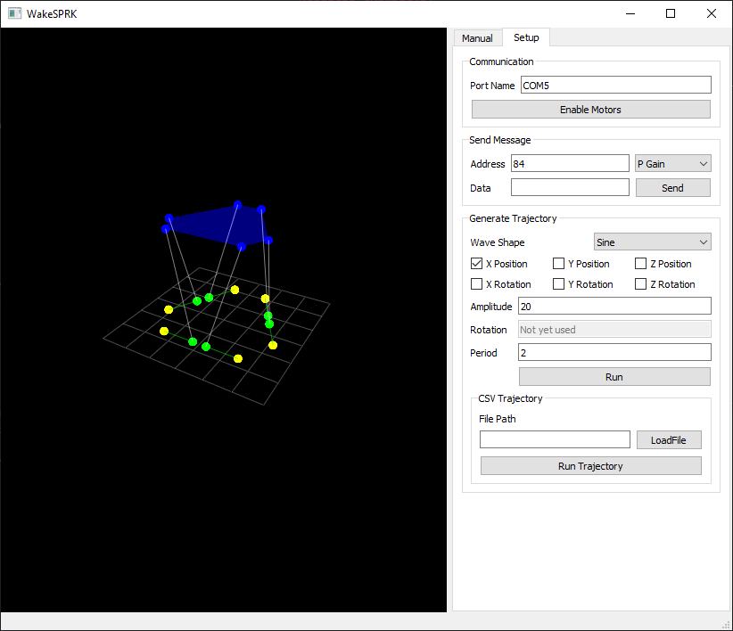

# Caution not yet released!!! Some hard-coded values remaining

# Wake-SPRK
![Steve][SteveDance]

Inspired by previous work to utilize a 6-DOF stewart platform design using [RSS links][1], this project provides a method to simulate motion to be used with a surgical robotic system.
The features of this project include:
* OpenGL visualization tool (pyqtgraph module)
* Motor communication with Dynamixel controller (specific motors used XM430-W210)
* (WIP) Optional ROS interface with command and read topics including TF information


## Examples
TODO 

## Dependencies
* Python 3 (recommend anaconda for common modules, conda environments, and spyder ide)
* pyqtgraph for fast visualization (depricated matplotlib viewer is given, but has poor performance)
* pyopengl for visualization
* Dynamixel SDK (generic driver installation might need to be included)

## Getting Started
Download software
* [Dynamixel Wizard 2.0][2]
* [Dynamixel SDK][3]

Programming software
* [Python][4] 
* [Spyder][5] 
* [Anaconda][6] 

1. Open the anaconda command prompt, navigate to the downloaded SDK directory, and run the setup file
```
C:\>cd C:\Users\schung\Downloads\DynamixelSDK-3.7.31\DynamixelSDK-3.7.31\python

C:\Users\schung\Downloads\DynamixelSDK-3.7.31\DynamixelSDK-3.7.31\python>python setup.py install
```
2. Install the pyqtgraph module from the anaconda prompt
```
conda install pyqtgraph
```
4. Install the pyopengl module from the anaconda prompt
```
conda install pyopengl
```
5. Run the main.py file from the repository

## Future Work
TODO


[1]: https://github.com/BerkeleyAutomation/sprk]
[2]: https://emanual.robotis.com/docs/en/software/dynamixel/dynamixel_wizard2/#software-installation
[3]: https://emanual.robotis.com/docs/en/software/dynamixel/dynamixel_sdk/download/#repository
[4]: https://www.python.org/downloads/
[5]: https://www.spyder-ide.org/
[6]: https://www.anaconda.com/
[SteveDance]: Media/Steve%20Dance.gif
